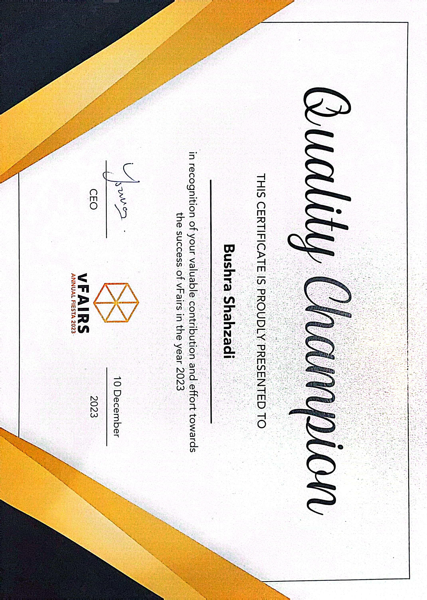
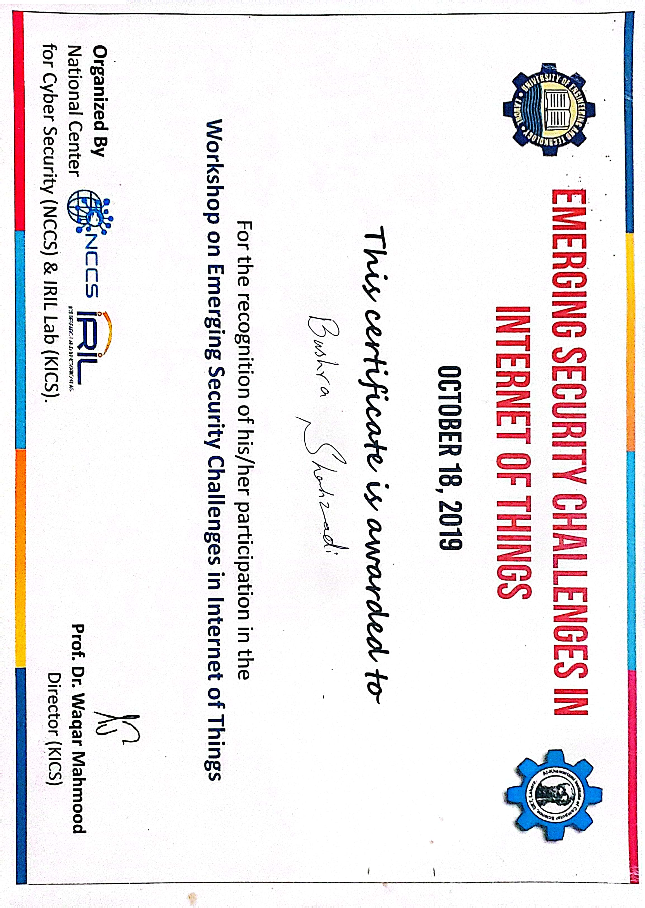
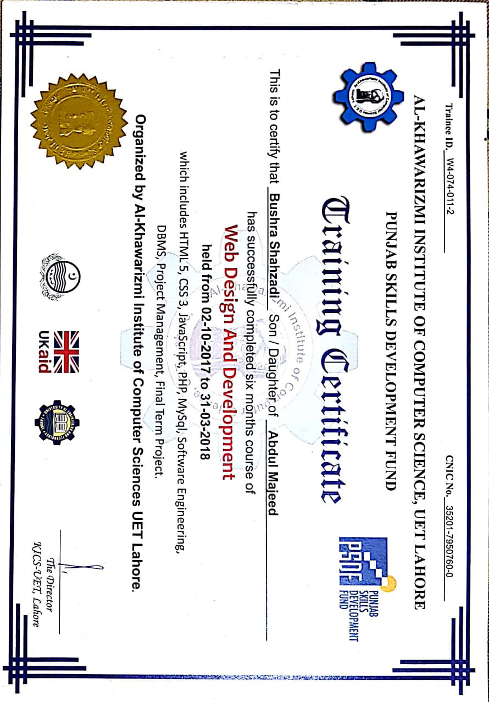
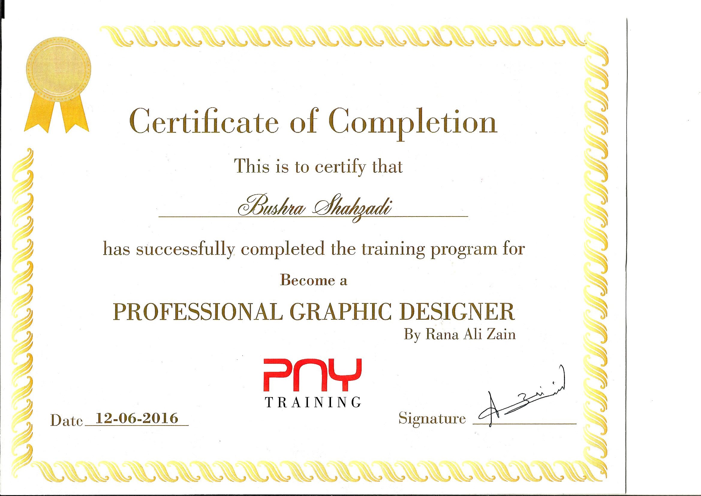
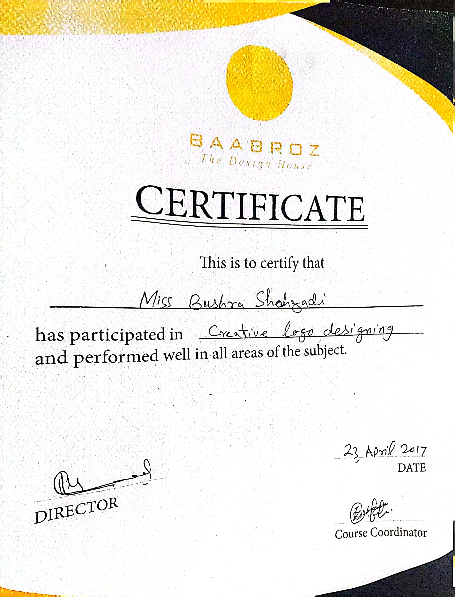
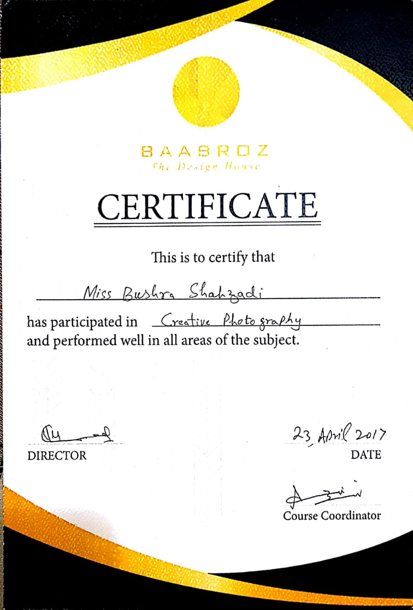
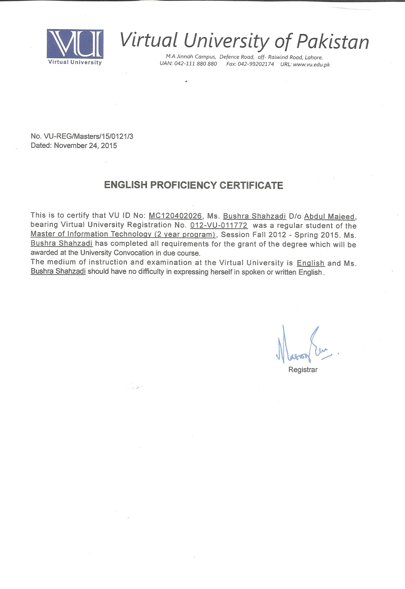

# 📜 Certificates & Awards — Bushra Shahzadi

All certificates listed here are original, verified documents.

---

## 🏆 Quality Champion — vFairs 2023
**Issuer:** vFairs Annual Fiesta  
**Date:** 10 December 2023  
**Description:** Awarded in recognition of valuable contribution and effort towards the success of vFairs in the year 2023. Signed by the CEO of vFairs.

---

## 🔒 IoT Security — Emerging Security Challenges in Internet of Things
**Issuer:** National Centre for Cyber Security (NCCS) & IRIL Lab (KICS), University of Engineering & Technology, Lahore  
**Date:** October 18, 2019  
**Description:** Certificate of participation in the Workshop on Emerging Security Challenges in Internet of Things. Signed by Prof. Dr. Waqar Mahmood, Director KICS.

---

## 🌐 Web Design & Development Training Certificate
**Issuer:** Al-Khawarizmi Institute of Computer Science, UET Lahore (Punjab Skills Development Fund — UK Aid)  
**Period:** 02 October 2017 to 31 March 2018  
**Trainee ID:** W4-074-011-2  
**Modules Covered:** HTML5, CSS3, JavaScript, PHP, MySQL, DBMS, Software Engineering, Project Management, Final Term Project  
**Signed by:** Director, KICS-UET Lahore

---

## 🎨 Professional Graphic Designer Certificate
**Issuer:** PNY Training  
**Instructor:** Rana Ali Zain  
**Date:** 12 June 2016  
**Description:** Certificate of Completion for Professional Graphic Designer training program covering design principles, tools, and creative techniques.

---

## 🎨 Logo Designer Certificate
**Description:** Certificate for Logo Design training.

---

## 📷 Photography Certificate
**Description:** Certificate of completion for photography training.

---

## 🇬🇧 English Proficiency Certificate
**Level:** B2 Independent User (Listening, Reading, Writing) — C1 Spoken Interaction  
**Description:** English language proficiency certification.

---

*All certificates are original documents belonging to Bushra Shahzadi. Available for verification on request.*
