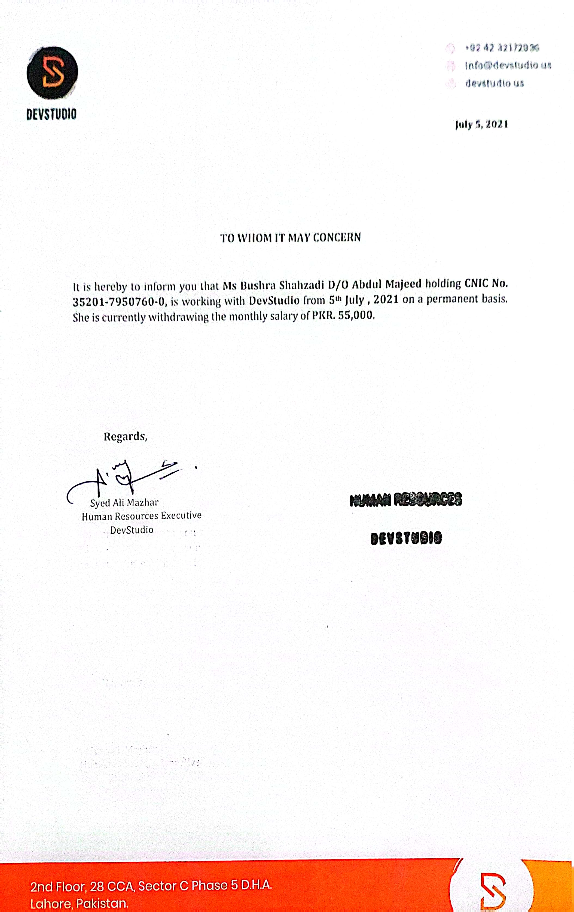
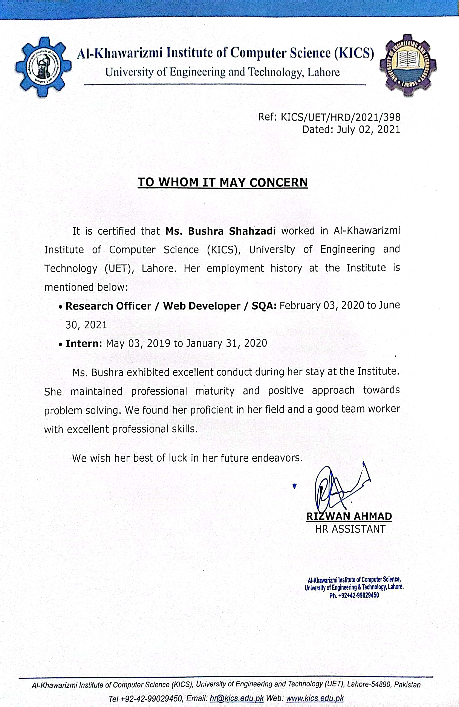
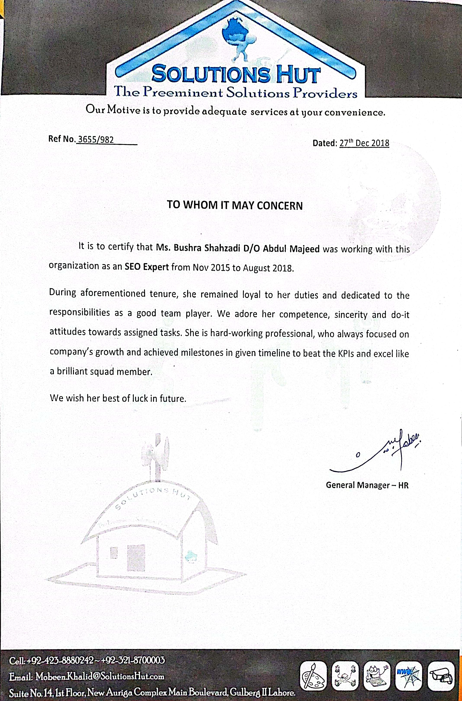

# 📄 Experience Letters — Bushra Shahzadi

All experience letters are original verified documents from former employers.

---

## 🏢 Innovation Insight — Current Role
**Position:** Senior SQA Team Lead & Project Manager  
**Period:** February 2022 – Present  
**Location:** Remote (UK)  
**Note:** Currently employed — reference available on request.

---

## 🏢 vFairs
**Position:** Senior Software QA Engineer (Part-Time)  
**Period:** September 2021 – February 2024  
**Reference:** Available on LinkedIn — [View recommendations](https://linkedin.com/in/bushra-shahzadi-5bb899214)  
**Achievement:** 🏆 Quality Champion Award 2023

---

## 🏢 DevStudio
**Position:** SQA Engineer (Permanent)  
**Period:** July 5, 2021 onwards  
**Signed by:** Syed Ali Mazhar, Human Resources Executive, DevStudio  
**Contact:** info@devstudio.us | devstudio.us

---

## 🏢 KICS — Al-Khawarizmi Institute of Computer Science, UET Lahore
**Position 1:** Research Officer / Web Developer / SQA  
**Period:** February 03, 2020 to June 30, 2021  
**Position 2:** Intern  
**Period:** May 03, 2019 to January 31, 2020  
**Reference:** KICS/UET/HRD/2021/398 — Dated July 02, 2021  
**Signed by:** Rizwan Ahmad, HR Assistant  
**Contact:** hr@kics.edu.pk | www.kics.edu.pk | Ph: +92-42-99029450

---

## 🏢 Solutions Hut
**Position:** SEO Expert  
**Period:** November 2015 to August 2018  
**Reference:** Ref No. 3655/982 — Dated 27th December 2018  
**Signed by:** General Manager – HR  
**Commendation:** *"She remained loyal to her duties and dedicated to the responsibilities as a good team player. We adore her competence, sincerity and do-it attitudes towards assigned tasks. She is a hard-working professional who always focused on company's growth and achieved milestones in given timelines."*

---

## 🏢 Digital First Private Limited
**Position:** SQA Engineer  
**Document:** PDF experience letter  

[📄 View PDF Letter](./digital-first-letter.pdf)

---

*All experience letters are original documents. Available for employer verification on request.*  
*Contact: bushrashahzadi307@gmail.com | +44 07833037092*
